**ELF DAPLink 用户手册**
[ 中文 | [English](./README_EN.md) ]

[TOC]

# 产品概述

**ELF DAPLink**是 **BiTForest** 推出的基于[ARM DAPLink](https://github.com/ARMmbed/DAPLink)的调试器和下载器，支持基于 ARM Cortex-M 核的全系列MCU的调试和下载。ELF DAPLink 在开源功能的基础上对底层协议进行了高度优化，在硬件上做到 DAPLink v1 和 v2 版本兼容，并支持3V3和5V。相比当前市面上流行的 STLinkv2 和 JLink OB，在 ARM 的 Keil MDK 开发环境下测试可以达到 STLinkV3 的烧录速度，与此同时支持国产芯片，而 STLinkV3 只能支持 STM32 系列芯片。

速度的提升，在开发大FLASH的MCU时，将节约大量的下载等待时间，对于一个开发组，一个公司将大大提高开发效率。在功能上，另一大亮点是支持 STC 免冷启动下载功能，这对于初学者，比如在校生，爱好者或者同时需要开发**ARM单片机和STC单片机**的开发学习者无疑带来了极大便利。

 和市面上的同类DAPLink相比，外观最大区别是：**对外接口排针是2X6**而不是 2X5，用于支持双虚拟串口。目前达到的功能和性能：

1.	经过高度优化的基于Bulk协议的 ELF DAPLink v2 让性能达到 STLinkV3 (基于Keil环境，针对Cortex-M0/0+/3/4/7不同芯片的实际烧写测试)，远远超过STLinkv2。烧写STM32H743，1M FLASH只需28s(含擦除，烧写和校验时间)。(不同性能的PC对速度略有影响，但是不大)。
2.	在支持Bulk版本的DAPLink v2的同时，支持HID 版本的DAPLink v1，只需要简单切换模式即可。有效兼容老版本的开发和下载软件，例如好用的烧写工具CoFlash。
3.	支持双路虚拟串口，这就是为何排针使用2X6的原因。双路虚拟串口可以单独设置波特率，互不影响，支持常见的固定波特率9600到230400，相当于两个USB转TTL小板，远远满足日常调试打印需求。
4.	同时支持 SWD 和 JTAG 协议。目前市面上常见的 DAPLink 均不支持 JTAG 协议。
5.	支持SWD软复位，使用SWD下载时，无需连接RST线。（部分国产芯片实测不支持软复位)。
6.	支持基于虚拟U盘的升级和用户模式功能配置，无需安装驱动和额外软件。支持升级时意外掉电防变砖。
7.	支持3.3V和5V供电输出，带自恢复保险丝，3V3和5V不小心接地短路不会对调试器电路造成损害。
7.	双LDO供电，输出3V3和调试器MCU的3V3由独立的LDO供电，更稳定，互干扰更小。3V3可稳定对外输出150mA。5V输出达300mA（实际可达450mA，为考虑安全可靠，限制为300mA）。通常的单片机最简电路只需要10-100mA的电流。
8.	UART硬件兼容5V和3V3电平。
9.	支持STC单片机的免冷启动下载功能。

**1 ELF DAPLink = 1 普通DAPLink + BULK高速下载 + 1 USB转TTL小板 + 1 STC免冷启动下载器。**体积小巧，携带方便。之所以给它取名字叫ELF，意为小精灵，但人小鬼大，一个顶仨。

# 环境要求

基于 BULK 协议的 DAPLink v2 版本必须使用Keil MDK 5.26.2 或更高版本，IAR 8.32.1 或更高版本。基于 HID 协议的 DAPLink v1 版本无此要求。

操作系统支持WIN7，WIN8和WIN10，WIN10 用户直接免驱动，即插即用。

# 驱动安装

WIN10 用户直接免驱动，即插即用。以下操作请忽略。WIN8.1版本和WIN7用户需要按一下步骤安装驱动。

## DAPLink v2 驱动安装

一个 ELF DAPLink 物理设备在电脑上会虚拟出三个设备，对应 DAPLink 调试器和两路虚拟串口。ELF DAPLink 默认出厂设置工作在 v2模式，此时需要针对此三个虚拟设备分别手动安装驱动。

第一次将调试器插入计算机的USB口时，Windows7会自动尝试安装驱动，点击右下角的安装提示信息，会弹出如下窗口，直接关闭即可。

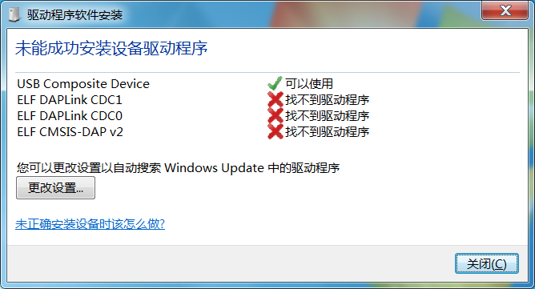

打开设备管理器，可以看到以ELF开头的三个设备出现在“其他设备“列表中。如果设备出现在了其他地方，请右击卸载设备并同时卸载驱动，然后重新插拔调试器。

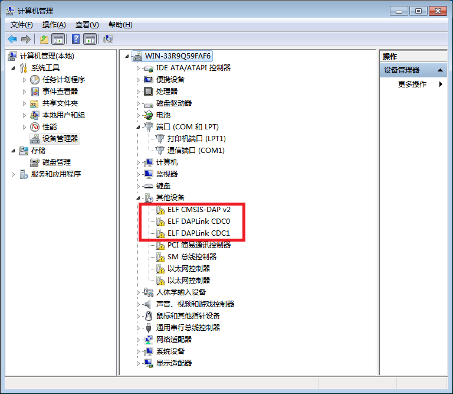

首先在 "ELF CMSIS-DAP v2" 上右击，选择“更新驱动程序”，弹出如下窗口并选择第二项：

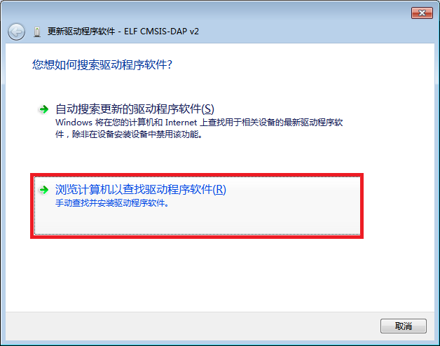

在如下窗口中选择”从计算机的设备驱动程序列表中选择“，然后点击”下一步“。

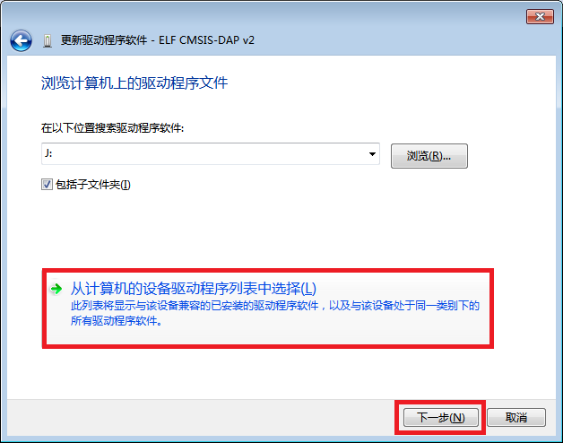

如下窗口中直接选择“下一步”，然后依次按照红色框选的按钮进行安装。

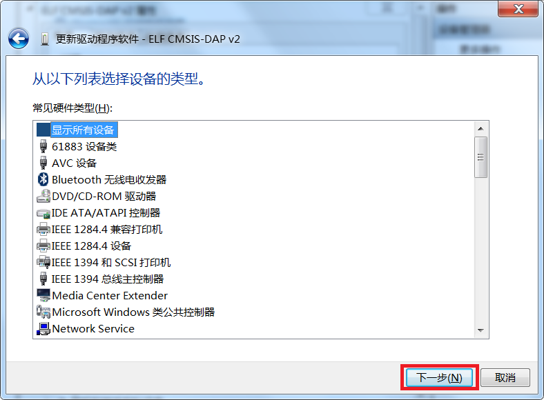

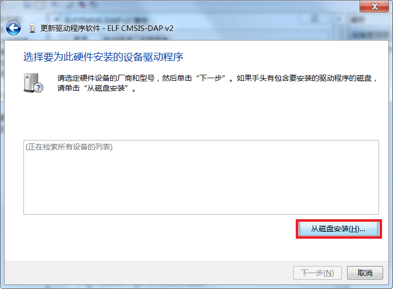

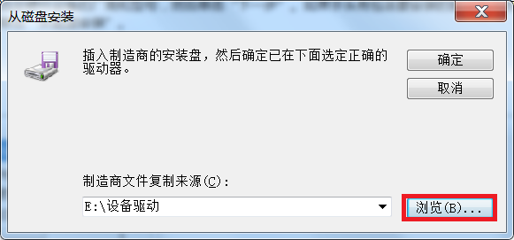

这里选择 ELF DAPLINK V2.inf 文件，对应虚拟串口则选择后缀为CDC0或者CDC1的inf文件。

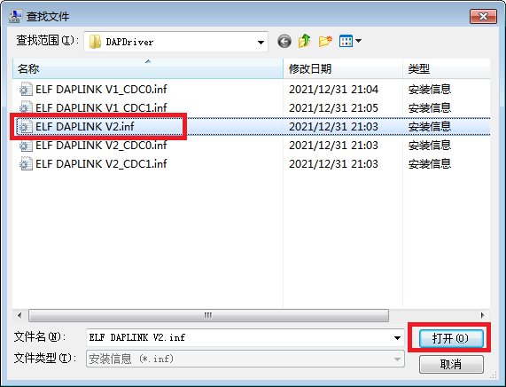

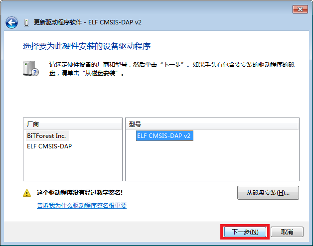

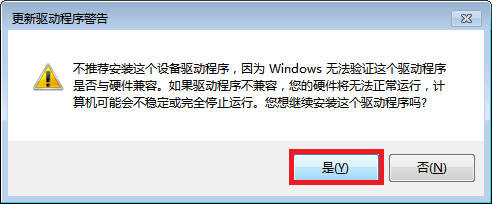

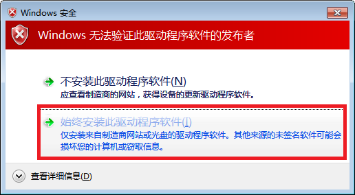

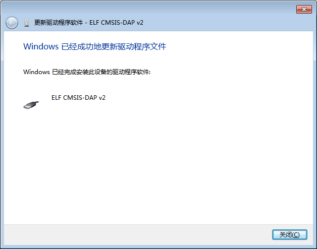

安装成功后，可以在设备列表中看到 ELF CMSIS-DAP v2 设备：

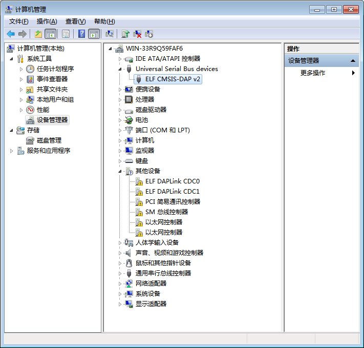

然后按照相同步骤为虚拟串口 ELF DAPLink CDC0 和 ELF DAPLink CDC1 安装驱动，注意分别选择 ELF DAPLINK V2_CDC0.inf 和 ELF DAPLINK V2_CDC1.inf 文件。

## DAPLink v1 驱动安装

参考 [版本切换和模式选择](#版本切换和模式选择) 首先将设备切换为 v1 模式，然后在设备列表中会看到如下设备：

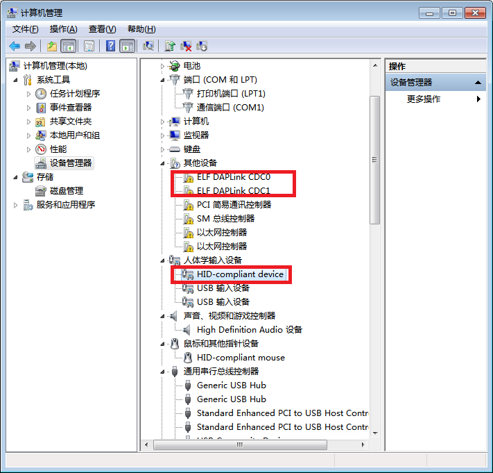

由于 DAPLink v1 版本使用HID协议，无需安装额外驱动，这里只需要为虚拟串口 CDC0 和 CDC1 安装驱动。按照DAPLink v2 的步骤，在选择inf文件时，分别选择 ELF DAPLINK V1_CDC0.inf 和 ELF DAPLINK V1_CDC1.inf 即可。安装完驱动后的设备列表如下所示：

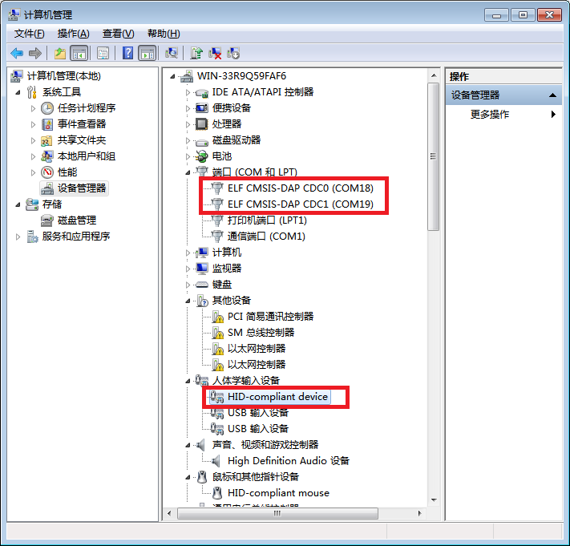

##DAPLink 功能验证

在Keil中打开任一ARM工程，在工程名称上右击选择"Options for..."。

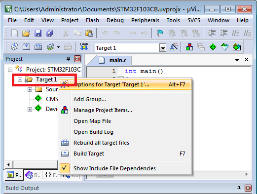

然后在"Debug"选项卡中选择"CMSIS-DAP Debugger"，然后点击"Settings"。

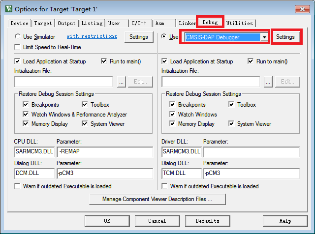

此时可以看到已经识别出调试器，以及调试器的序列号和版本，如果连接有目标板，可以看到目标板上MCU的IDCODE等信息。

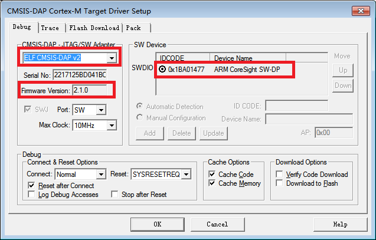

如果使用的是 DAPLink v1 版本，则显示如下：

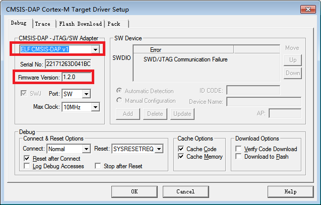

## 虚拟串口功能验证

使用任一串口终端工具，点击“刷新”按钮然后查看下拉列表，可以看到两个虚拟串口：

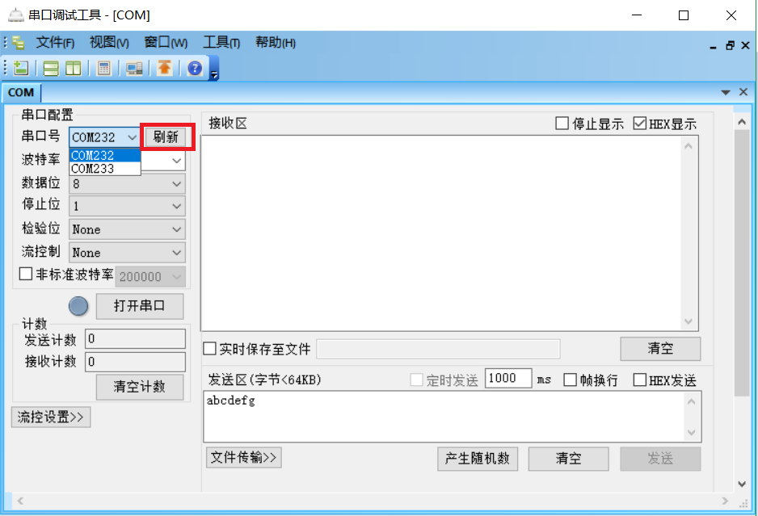

选择任一串口，并使用杜邦线短接RX/TX或者RX1/TX1。通常小标号的COM口对应调试器上的RX/TX，但这不是绝对的，RX/TX对应的COM口在终端打开串口时，信号灯会闪烁，RX1/TX1对应的COM口在打开时不会闪烁，请以此信号为准。

此时选择发送会收到发送的数据，表明串口工作正常，同样方式测试另一路虚拟串口。注意波特率的选择，支持的波特率为9600-230400。

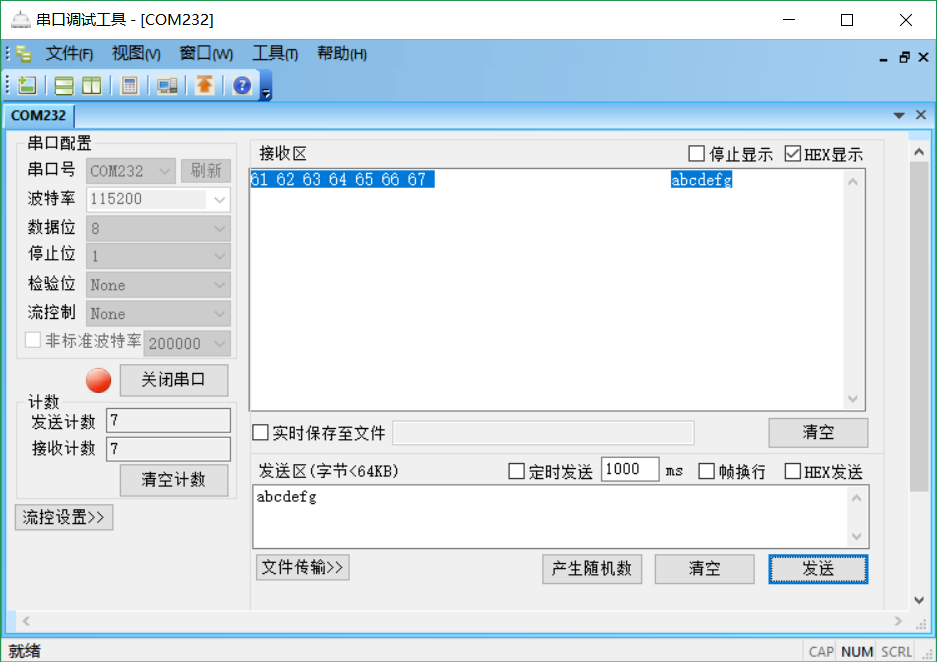

# 版本切换和模式选择

ELF DAPLink支持用户模式和配置模式：

1.用户模式下支持DAPLink v2 和 DAPLink v1，默认模式为 DAPLink v2。两种版本下均可同时开启STC免冷启动烧写功能（部分版本支持，默认开启STC免冷启动烧写功能）。

2.配置模式下可以对用户模式下的功能进行使能和关闭。**杜邦线短接GND和RST，重新上电设备进入配置模式。**注意进入配置模式时，其他端子不要连线。

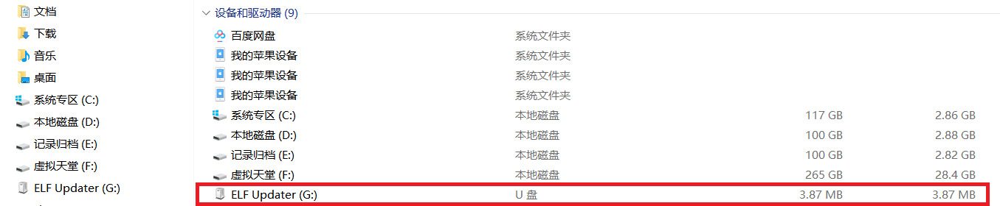

首次进入配置模式需要较长时间安装虚拟U盘驱动，当正确显示出名称和容量时，可以进行配置操作。该模式下，不要直接插拔调试器，应通过右下角弹出设备后再插拔，否则下一次进入配置模式需要较长时间发现虚拟U盘。如果长时间没有出现U盘，或者没有显示出容量信息，请重新插拔调试器。 

注意， U盘大小是虚拟的，没有真实的FLASH对应，它是用来升级和配置调试器的接口，不要使用该虚拟U盘存储任何用户文件。

## 功能配置

对用户模式功能的配置通过文本命令进行，新建文本文件，文件名任意，不要过长，输入如下命令：

| 命令    | 功能说明                                                     |
| ------- | ------------------------------------------------------------ |
| hid=0/1 | hid=1 切换为 v1 版本，hid=0 切换为 v2 版本                   |
| stc=0/1 | stc=1使能，stc=0关闭stc免冷启动下载。使能后调试器上电时信号指示灯会快闪一段时间。 |

如果平时无需使用STC免冷启动功能，可以选择关闭。

所有命令均是英文模式输入。多条命令可以使用逗号分隔。例如创建文本文件 stcv1.txt，输入如下命令：

`hid=1,stc=1`

 该命令用于切换到 DAPLink v1 版本，同时使能 STC 免冷启动下载。编辑完毕后，在文本文件图标上右击选择发送到 ELF Updater，发送完毕后，调试器会自动重启。**此时去掉短接线。配置信息在下次重新上电时保持有效。如果没有去掉短接线，下次上电后会再次进入配置模式。**

## 系统升级

与功能配置类似，首先进入配置模式，然后在需要升级的bin文件上右击发送到ELF Updater的虚拟U盘，升级成功后设备会自动重启，**此时不要忘记去掉短接线。**

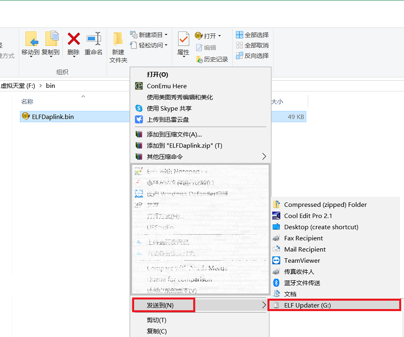

#指示灯说明

ELF DAPLink 调试器上载有两颗LED，用于信号指示：

1.左侧LED是电源指示灯，上电后常亮。

2.右侧LED是信号指示灯，被虚拟串口CDC0，STC免冷启动下载和调试功能复用。

| 信号指示灯 | 功能说明                              |
| ---------- | ------------------------------------- |
| 上电时快闪 | stc 免冷启动开启                      |
| 快闪       | PC串口终端打开RX/TX对应的串口时，快闪 |
| 常亮       | 调试器烧写或者调试进行时              |

部分开源软件，如OpenOCD在烧写完毕后可能不会关闭调试指示灯。

# Keil下载和调试

## SWD软复位

使用SWD协议下载时，可以不接RST线而实现下载后自动重启：

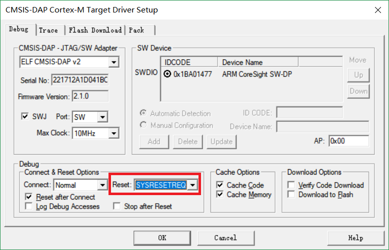

注意一定要勾选Reset and Run，并注意下载算法与目标芯片是否一致，如果不一致则点击 Add 添加对应的FLASH下载算法。

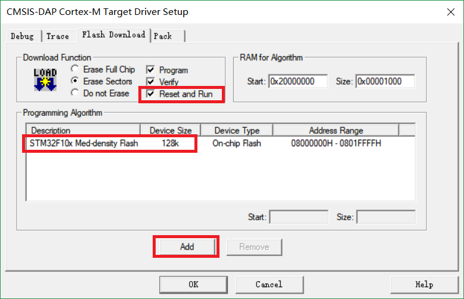

某些国产替代芯片，例如GD, APM等可能不支持软复位，此时需要连接RST以实现下载后自动重启。有些丝印为STM32的芯片，如果IDCODE和原厂不一致，也应该连接RST，并注意FLASH下载算法的选择。

注意：使用JTAG协议下载时，必须连接RST。

## Keil调试中可能遇到的问题

###调试时没有直接跳到main函数

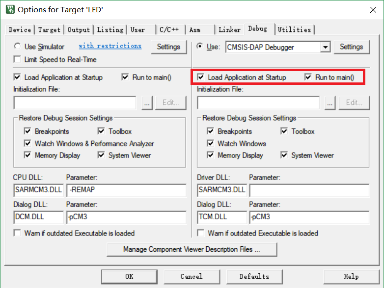

需要选中Run to main()。

### 调试时有些代码行不能设置断点

查看优化设置，有些行被编译器优化后就不能设置断点。点击汇编窗口，对比代码可以查看是否被优化。

### C语言窗口无法设置断点

在Keil中，如果发现DAPLink只可以在汇编窗口设置断点，而不能在C语言窗口设置断点，这很可能是Debug配置（是基于其他调试器或者芯片的项目切换过芯片和调试器）不匹配导致。该现象通常出现在从他处直接复制工程的情景，如果是本地新建的工程通常不会出现该问题。 

解决方法：只要将工程目录下的 DebugConfig 文件夹删除，重新打开工程选择调试器并配置调试选项即可。

### 调试或烧写时弹出RDDI-DAP ERROR错误

首先确认目标板供电是否异常。再次检查下载线是否连接正确，GND一定要连接。然后尝试使用短的USB线和杜邦线，并尝试替换这些线缆。如果有其他目标板，可以交叉验证调试器是否损坏。

连线松动，接触不良：当前使用最多的杜邦线，内芯纤细，电阻较大，抗干扰能力差，并且线缆和端子间通过冷压方式连接，长期使用易松动。为了得到更好的调试环境，推荐使用2.54端子和特氟龙线缆自制专用调试线。

 不要使用双绞线，目标MCU不支持高频率调试通信，特别是Cortex-M0+系列，或者使用了低频晶振，应该降低下载器通信频率。

### 程序配置导致的调试失败

MCU内部的调试模块能够正常工作需要满足：

1. 内部时钟或者外部时钟电路正常，软件配置必须和硬件时钟频率保持一致，否则可能导致调试模块不工作。（如果软件配置使用外部晶振，外部晶振不稳定，将导致调试异常，可以通过示波器观察晶振管脚波形）。

2. 通过SWD调试时，必须保证SWDIO和SWCLK管脚未禁用，或者被其他功能复用，有些bin文件为何防止烧写后被读取，会禁止SWD调试，此时可以通过BOOT0/1组合进入ISP模式然后烧写。也可以使用OpenOCD或者PyOCD开源软件进行解锁，解锁会清除FLASH。

3. 通过JTAG调试时，必须保证SWDIO(TMS)，SWCLK(TCK)，TDI和TDO管脚未禁用，或者被其他功能复用。

 注意一些MCU支持SWD和JTAG调试口的重映射，如果硬件/软件进行了相关配置，需要按照映射后的管脚进行连线。 

JTAG为标准5线协议，也即必须使用调试器的RST连接目标板的RST，以进行自动复位。JTAG是比SWD协议更广泛应用的调试协议；SWD是ARM专门为Cortext-M系列内核优化的调试协议，它支持软复位，也即无需连接nRST，IDE或者上位机可以通过SWDIO下发命令复位目标板。

 任何时候，GND都是默认必须连接的。

### Keil中无法找到调试器

在这设备管理器中可以找到调试器，但是在Keil中选择CMSIS-DAP Debugger，下拉列表中无法找到调试器，这通常发生在电脑使用过类似调试器，或者新安装过开发环境，更新过WINUSB驱动等，因为驱动冲突导致失配，通常只要在设备管理器中卸载设备，然后重新插拔即可。如果还是不工作，可以尝试使用另一台电脑，看Keil是否能发现设备，如果可以，说明硬件没有问题，重新安装开发环境再尝试。

 使用过长或者劣质的USB数据线，也可能出现该问题，可以尝试使用较短的优质USB数据线。出现驱动错误时，串口依然可以正常使用。

### 烧写时提示 Not a genuine ST Device

首先检查IDCODE和STM32原厂一致。在确定是原厂MCU的情况下，可能原因是HSE时钟与外部晶振时钟配置不匹配。在设置时钟树时，HSE时钟设置的是8.00MHZ，但开发板上的不是。 

解决方式主要有两种：

1. 卸载外置晶振，使用内部时钟工作，重新烧写代码（修改好HSE的设置部分），重新焊接外置晶振，即可正常工作

2. 设置BOOT0上拉到VDD（3.3V），重新烧写代码（修改好HSE的设置部分），重新下拉BOOT0至GND，即可正常工作。

 方案二更容易操作，适用性更高。

 STM32有三种启动方式，ISP下载就属于其中一种，这里使用SRAM启动，就是第二种方法。先将BOOT0上拉，即BOOT0 = 1，之后需要将BOOT0拉低，即BOOT0 = 0。

### FLASH无法擦除等奇怪问题

根据芯片BOOT0/1的组合，进入ISP模式然后重新下载通常可以解决问题，仔细检查程序中是否有禁用SWD/JTAG，或者复用了这些管脚。

 程序错误导致跑飞，也有可能导致SWD/JTAG调试模块异常。

# STC 免冷启动下载

##注意事项

STC烧写必须对MCU彻底断电然后上电，此时MCU从ISP程序执行，这就是所谓冷启动。如果不断电，而直接通过RST重启，就是热启动，热启动直接执行用户代码，而跳过ISP程序，这就是为何STC烧写必须通过冷启动实现的原因。

STC成功烧写需要注意两点：

1.内置振荡器外部晶振必须满足较小的波特率误差，例如使用11.0592MHz晶振，波特率可以接近0误差。STC-ISP工具中提供了波特率计算器，不同的晶振和波特率，误差不同。

2.STC-ISP上位机设置合适的最低波特率。实际上最高波特率和下载信息中的当前波特率都没有使用，而是直接使用的最低波特率。对于早期的芯片，最高只能支持19200。

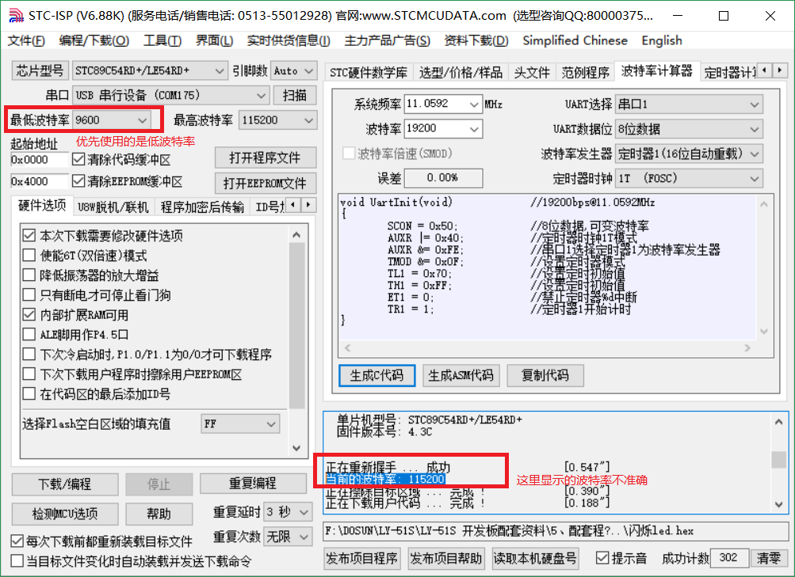

## STC-ISP烧写

请到STC官网下载最新的STC-ISP工具。检查 ELF DAPLink STC免冷启动下载功能是否开始，也即上电时信号灯是否快闪。另外**必须使用调试器的RX/TX口连接目标板的TX/RX，并使用调试器对目标板供电。**(只有虚拟串口0支持免冷启动下载)。

STC-ISP提供了强大功能，可以自动检测所接MCU的型号，但是对于比较老旧的芯片型号，例如STC89C52XX等，不支持直接自动检测MCU。此时必须在芯片型号下拉类表中选择对应的型号，然后才能检测MCU选项。对于较新的型号，无需选择芯片型号，而在连接好下载器的TX，RX，GND和VCC后，直接按照以下流程进行操作：

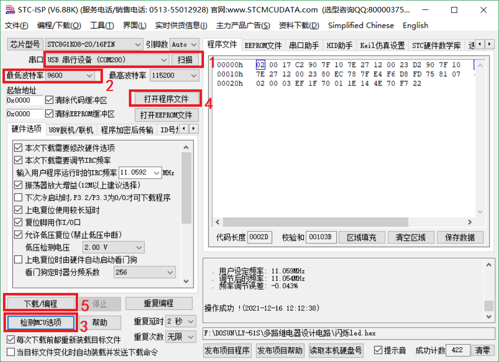

ELF DAPLink 板载STC下载器使用单独的3V3电源芯片对外供电，可以提供高达150mA(3V3)，300mA (5V，实际可达450mA，但是基于散热需求，推荐使用最大300mA)。 

可用万用表等设备测试目标板的实际电流需求。通常对于没有高耗电外设的开发板，可直接使用下载器供电。如果目标板工作在3V3，而提供了5V输入接口，优先使用5V供电，直接连接下载器的5V到目标的5V排针端子上。 

注意：**任何时候都只能使用一种方式对目标板供电，要么使用下载器供电，要么使用开发板自带电源，而不要同时供电（也即在使用开发板自带电源供电时，不要连接下载器的3V3或者5V端子），否则会导致电流倒灌入下载器。注意：要实现免冷启动方式下载，必须使用本下载器供电。**

如果目标板具有屏幕，多路继电器等高耗电设备，要实现免冷启动下载，可以将高耗能外设的电源接口断开，另一种更保险的方式是使用外扩供电电路，把下载器的3V3/5V管脚作为控制端，当STC-ISP进行下载器，3V3/5V管脚会输出一段低电平，作为信号控制端控制外扩电路。 

如果目标板具有大电容，可能导致下载时无法将剩余电量释放干净，STC MCU无法进入下载模式，免冷启动下载失败，此时也应该使用外扩电路在信号控制端低电平时对目标板短路放电。由于大电容放电时，释放的电量转化为热量，需要较大功率的放电管，无法直接集成在体积小巧的下载器上。 

优先选用优质的较短的USB数据线可以提高实际供电能力。较长的，或者质量低劣的USB数据线将导致较大压降，请使用万用表检查数据线是否满足供电要求。

## 烧写波特率选择

由于STC单片机的程序通常很小，使用较小的波特率也不会耗时很久，还可以保证稳定下载，推荐使用较低波特率。对于比较老旧的 STC 单片机型号，推荐 9600 波特率。而较新的MCU可以支持到115200波特率，为了防止切换STC MCU型号时忘记设置波特率而导致下载失败，考虑到通常C51的程序不是很大，推荐设置为9600。具体能够支持的最大下载波特率请参考芯片手册。

 当选择不合适的波特率时，将出现目标板不停重启的现象，这是STC-ISP程序在不停尝试下发烧写请求命令，而目标MCU无法响应该波特率导致。

# 附录

## Keil开发中常见的非调试问题

### 代码浏览右击不能自动跳转

参考：http://www.openedv.com/posts/list/16228.htm

 为什么我的MDK已经勾选了 browse information 但还是不能够跳转至相应函数处，依然会提示 "no browse information available in..." 

原因：工程在中文（含宽字符的空格，其他不可见字符，非常规字符等例如括号等）目录下，或者工程目录名称太长；系统内存太小也会出现创建浏览数据库失败问题，此时底部状态栏创建状态在更改代码后一闪而过。

解决方法：更正后，在options for Target —outputs—选中browser information ，需要重新编译，编译时会重建浏览信息数据库。

第二种情况，关闭其他占用内存较大的程序，重新打开工程，也会重建数据库，底部状态栏会提示创建浏览信息…，第一次创建需要较长时间，此时在函数或变量上右击跳转选项菜单是灰色的，重建完毕后就变为可用状态了。

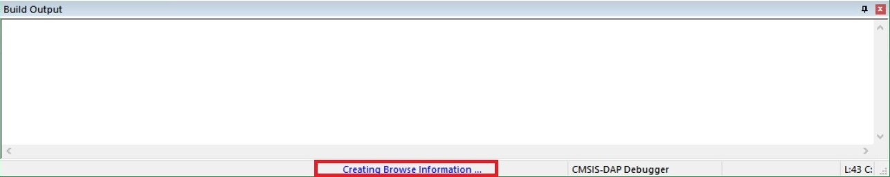

###Encountered an improper argument

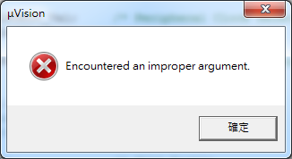

MDK偶尔会出现错误提示“***Error: Encountered an improper argument\***”。大概意思是说“错误：遇到不正确的参数”。出现这种情况时，对话框关掉之后会再次出现，只能使用任务管理器强制停止才行。

参考：http://www.keil.com/support/docs/4036.htm

原因：μVision5调试器目前无法处理包含带有UTF-8字符的文件夹或文件名的DWARF调试信息。

解决方法：请勿在项目的文件夹和文件名以及所有源文件和库中使用非ASCII字符，例如中文注释。

但是实际测试发现该问题可能和中文没关系，而是和断点设置有关系。

解决方法：在退出调试前清除所有断点。 

重新进入调试界面可能软件再次崩溃，这是因为还未进入调试界面前不能标有断点，即再次进入调试界面前一定不能有断点。
